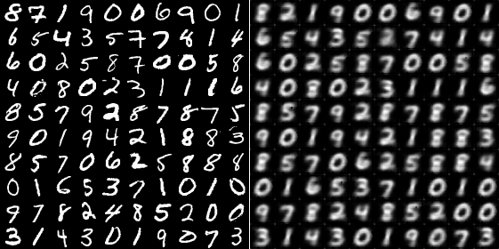
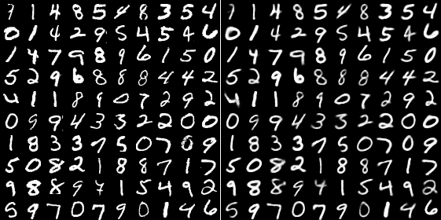

# WECaps
Ensembled Gromov-Wasserstein (EGW) framework is proposed for finding the degree of alignment between an input and the components modeled by the capsule sequence. This strategy leverages new insights on defining alignment between the input and the capsule sequences as a function of the similarity between their respective component distributions.

## Benchmarks

EGWCaps can be evaluated on 4 benchmarks: MNIST, FashionMNIST, SmallNORB, and CIFAR10.


## Usage

**Clone this repository to local**

```python
https://github.com/Anony-22/WECaps.git

cd WECaps
```


**Requirements**

* 1 GPU
* Python 3.5 or higher
* PyTorch 1.0.1
* Torchvision 0.2.1
* TQDM


**Train EGWCaps on MNIST**

```console
$ python train.py --model=MNIST --dataset=mnist
```
It will train the model for 100 epoches and outputs are saved in the <reconstractions> directory.


**Reconstraction results**

Reconstraction results on 1 and 100 epoches.
Digits at left are the real images from MNIST and digits at right are the corresponding reconstructed images.





